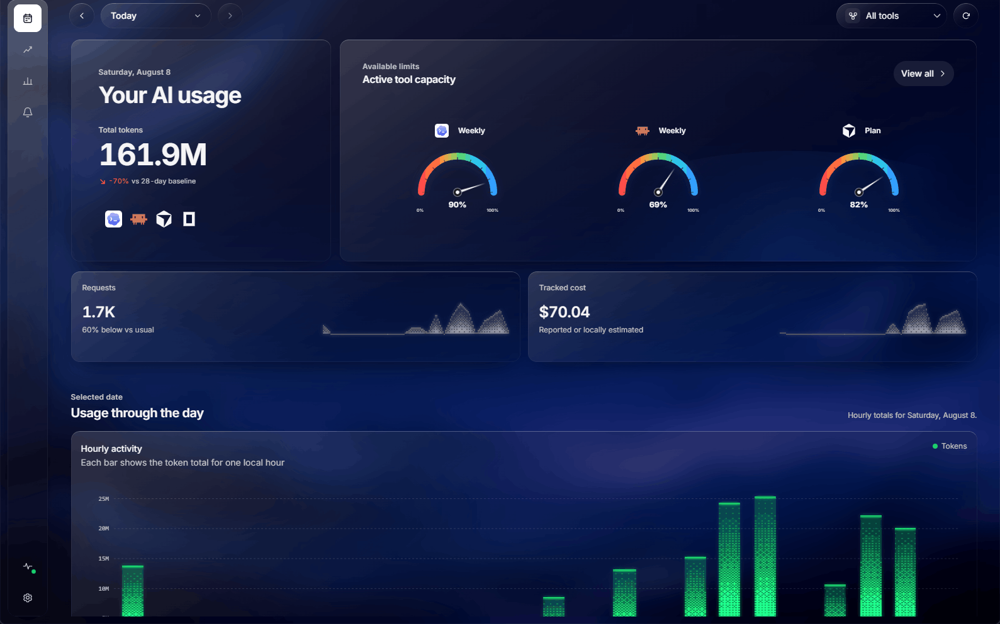
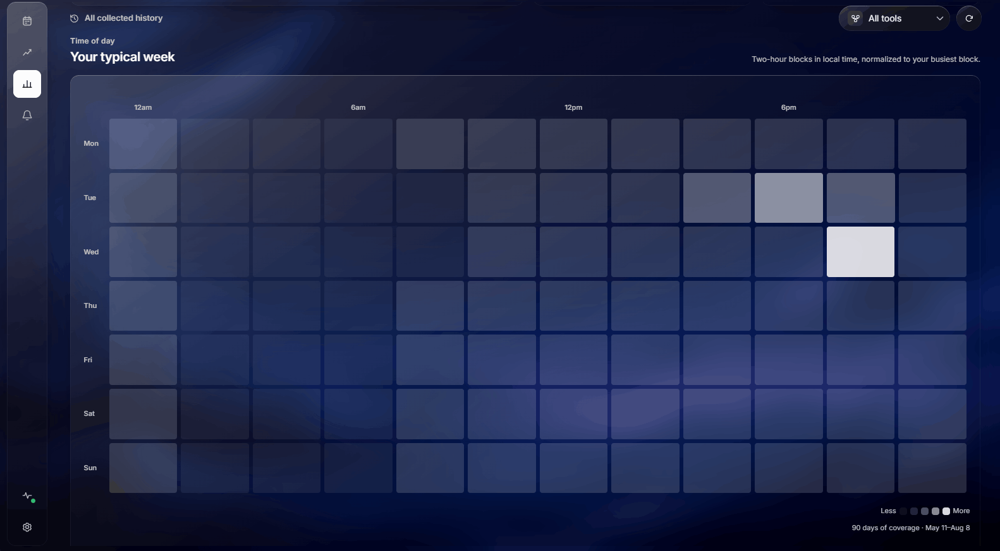

<p align="center">
  
</p>

<h1 align="center">UsageAtlas</h1>

<p align="center">
  One desktop dashboard for your AI coding usage.<br>
  See quota, resets, tokens, requests, and cost across Codex, Claude, Cursor, and OpenCode — read locally, never uploaded.
</p>

<p align="center">
  <a href="https://usageatlas.com/#download"><strong>Download for Windows, macOS, or Linux</strong></a>
  ·
  <a href="https://github.com/SRX9/UsageAtlas/releases">All releases</a>
</p>

<p align="center">
  <a href="https://github.com/SRX9/UsageAtlas/actions/workflows/ci.yml"></a>
  
  <a href="LICENSE"></a>
</p>

## Screenshots

<p align="center">
  <a href="docs/images/usageatlas-today.png"></a>
  <a href="docs/images/usageatlas-week.png"></a>
</p>

## Install

Get an installer from [usageatlas.com](https://usageatlas.com/#download) or the
[releases page](https://github.com/SRX9/UsageAtlas/releases), then:

- **Windows** — run the `.exe` installer. Builds are not Authenticode-signed yet, so choose **More info → Run anyway** at the SmartScreen prompt.
- **macOS** — open the `.dmg` and drag **UsageAtlas** into Applications. Builds are signed and notarized.
- **Linux** — run the `.AppImage`, or install the `.deb` or `.rpm`.

Every asset is listed with its SHA-256 in `SHA256SUMS` on the release. macOS and Windows update themselves in the background.

## What it reads

UsageAtlas reuses the credentials the tools already keep on your machine. Nothing else is needed to sign in.

- **Codex** — talks to the installed, signed-in Codex CLI through its official local app-server API. The OAuth token is never read.
- **Claude** — reads `CLAUDE_CODE_OAUTH_TOKEN` or `.credentials.json` in your Claude config directory, then queries the OAuth usage endpoint.
- **Cursor** — reuses the signed-in desktop session from Cursor's local state database for account limits plus 90 days of per-request token, model, and cost history.
- **OpenCode** — reads the local OpenCode database for per-step token, request, project, model, and cost analytics.

Four more providers are on the way. A provider only ships once it has complete authentication, structured error
handling, and deterministic adapter tests.

## Highlights

- Today view with capacity meters, reset times, plan details, credits, and hourly activity
- History and insights across 7, 30, and 90 days by project, session, model, and tool
- Usage alerts that fire a native notification before you run into a limit
- Tray presence, launch at login, and system/light/dark themes
- Local-first: no account, no sync, and no usage data leaves the machine
- Sandboxed renderer with no Node.js access, an allowlisted preload API, ASAR integrity, and Electron fuses

## Privacy

Provider data is read from local files and provider APIs, cached in memory, and written nowhere else. There is no
UsageAtlas account and no cloud sync. An anonymous install count tells us how many people use the app; it never
includes usage figures and can be switched off in Settings. Diagnostics are redacted before they are shown or copied.

## Build from source

Requirements: Bun 1.3.14 and Node.js 22.13+.

```bash
git clone https://github.com/SRX9/UsageAtlas.git
cd UsageAtlas
bun ci
bun run desktop:start
```

`bun run check` runs lint, typecheck, tests, and the build. `bun run desktop:make` produces installers for the current
platform with Electron Forge; unsigned builds need no credentials.

The repo is a Bun + Turborepo workspace: the Electron app lives in `apps/desktop`, shared schemas and fixtures in
`packages/contracts`, and build helpers in `tooling`.

## Releases

Bumping the version in `apps/desktop/package.json` on `main` builds, signs, and notarizes every platform, tags
`desktop-v<version>`, and publishes the installers, `SHA256SUMS`, and the update feeds the in-app updater consumes.

See [CONTRIBUTING.md](CONTRIBUTING.md) to contribute and [SECURITY.md](SECURITY.md) to report a vulnerability privately.

## Acknowledgements

Inspired by [CodexBar](https://github.com/steipete/codexbar) by Peter Steinberger. Charts are vendored from
[Dither Kit](https://tripwire.sh).

## License

Source code is available under the [MIT License](LICENSE). The UsageAtlas name and logo are not covered by it — see
[TRADEMARKS.md](TRADEMARKS.md).
