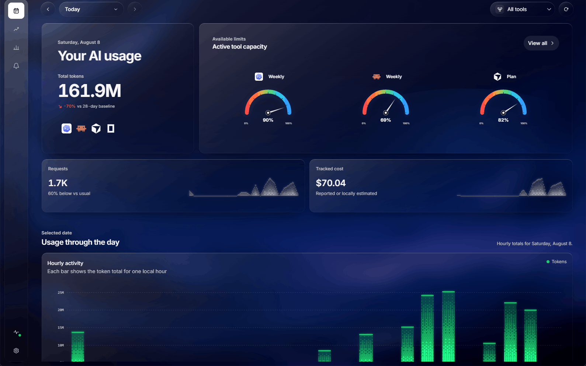
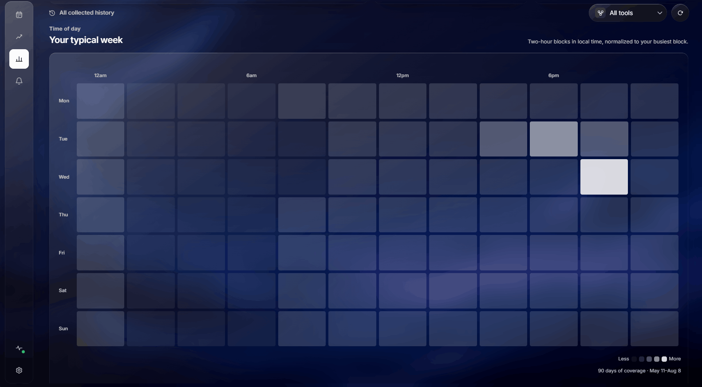

<p align="center">
  
</p>

<h1 align="center">UsageAtlas</h1>

<p align="center">
  One desktop dashboard for your AI coding usage.<br>
  Track AI coding history, allowances, and balances across 14 tools. No UsageAtlas account required.
</p>

<p align="center">
  <a href="https://usageatlas.com/#download"><strong>Download for Windows, macOS, or Linux</strong></a>
  ·
  <a href="https://github.com/SRX9/UsageAtlas/releases">All releases</a>
</p>

<p align="center">
  <a href="https://github.com/SRX9/UsageAtlas/actions/workflows/ci.yml"></a>
  
  <a href="LICENSE"></a>
</p>

Use UsageAtlas without an account to track usage on your computer. If you want to keep a copy of your usage history
and restore it after changing or losing a computer, you can create a free account and use cloud save.

## Screenshots

<p align="center">
  <a href="docs/images/usageatlas-today.png"></a>
  <a href="docs/images/usageatlas-week.png"></a>
</p>

## Install

Get an installer from [usageatlas.com](https://usageatlas.com/#download) or the
[releases page](https://github.com/SRX9/UsageAtlas/releases), then:

- **Windows** — run the `.exe` installer. Builds are not Authenticode-signed yet, so choose **More info → Run anyway** at the SmartScreen prompt.
- **macOS** — open the `.dmg` and drag **UsageAtlas** into Applications. Builds are signed and notarized.
- **Linux** — run the `.AppImage`, or install the `.deb` or `.rpm`.

Every asset is listed with its SHA-256 in `SHA256SUMS` on the release. macOS and Windows update themselves in the background.

## What it reads

UsageAtlas reads local activity and reuses supported tool sign-ins. Providers that require an API key or session can be connected in **Settings → Sources**.

- **Codex** — talks to the installed, signed-in Codex CLI through its official local app-server API. The OAuth token is never read.
- **Claude** — reads `CLAUDE_CODE_OAUTH_TOKEN` or `.credentials.json` in your Claude config directory, then queries the OAuth usage endpoint.
- **Cursor** — reuses the signed-in desktop session from Cursor's local state database for account limits plus 90 days of per-request token, model, and cost history.
- **OpenCode** — reads the local OpenCode database for per-step token, request, project, model, and cost analytics.

- **Antigravity** reads local CLI conversation databases for timestamped tokens, requests, models, sessions, and API-price estimates.
- **Pi / OMP** reads local JSONL sessions for Anthropic and OpenAI Codex backend usage, including cache tokens, projects, and API-price estimates.
- **Muse Code** reads local inference and automated-review events for token, request, model, and session history. Monetary costs remain unknown.

Antigravity, Pi / OMP, and Muse Code collect local history without credentials. They do not collect subscription quotas.
See [provider setup and field mappings](docs/LOCAL_PROVIDERS.md) for supported locations and limitations.

Seven more integrations read current provider allowances and balances:

- **Warp** reads monthly and add-on credits, with workspace pools kept separate.
- **Kimi Code** reads five-hour, weekly, and monthly allowances for the selected region.
- **Kilo Code** reads active credit blocks, balances, and Kilo Pass usage for a personal or organization scope.
- **GitHub Copilot** reads reported premium, chat, and completion quotas, plus seat credit usage where available.
- **Factory / Droid** reads Standard and Core limits, extra usage balances, and supported legacy billing counters.
- **Amp** reads Free and Agent allowances, Orb hours, and personal and workspace balances.
- **Qoder** reads personal and shared credits for the selected region.

These seven do not provide token, request, project, or cost history through these integrations. Missing allowances stay unknown. Credentials saved in Settings use the operating system's encrypted storage and never enter cloud saves. See [quota provider setup](docs/QUOTA_PROVIDERS.md) for credentials, supported formats, and limitations.

## Highlights

- Today view with capacity meters, reset times, plan details, credits, and hourly activity
- History and insights across 7, 30, and 90 days by project, session, model, and tool
- Usage alerts that fire a native notification before you run into a limit
- Tray presence, launch at login, and system/light/dark themes
- Local tracking with no account required
- Optional free account to save usage history to the cloud and restore it on another computer
- Sealed local history: completed days are stored on disk so past usage survives restarts and provider outages
- Sandboxed renderer with no Node.js access, an allowlisted preload API, ASAR integrity, and Electron fuses

## Privacy

Provider data is read from local files and provider APIs. Completed-day usage and capacity
snapshots are stored in a local history database in the app data directory. Without signing in to
UsageAtlas, your usage history stays on your computer.

If you choose a free account, cloud saves store usage totals, estimated costs, hourly activity, model
breakdowns, and limits and plan information under that account. They also retain per-request timestamps,
model identifiers (including private model names), numeric token and cost measurements, collection metadata,
and opaque project and session identifiers. Project and session names, file paths, prompts, responses,
raw transcript logs, and coding-tool credentials are not included. Restoring cloud history does not restore
local project paths or session names.

The optional anonymous install count is separate from cloud save. It never includes usage figures or your
account name or email, and you can switch it off in Settings. Diagnostics are redacted before they are shown or copied.
See the [privacy policy](https://usageatlas.com/privacy) and [terms of use](https://usageatlas.com/terms).

## Optional free cloud save

1. Open **Settings → Cloud save** in the desktop app.
2. Sign in with Google or GitHub to create or use a free UsageAtlas account.
3. Pending usage saves automatically once an hour while the app is running. You can turn off **Save automatically**
   and use **Save to cloud** whenever you want. A previous automatic-save choice is remembered on this computer.
4. On another computer, sign in to the same account and choose **Restore from cloud**.

Only successfully saved history can be restored. Check that saving has completed before removing local app data
or replacing your computer. Signing out stops future saves but does not delete existing cloud history. To request
account and cloud-history deletion, email [privacy@usageatlas.com](mailto:privacy@usageatlas.com).

## Build from source

Requirements: Bun 1.3.14 and Node.js 22.13+.

```bash
git clone https://github.com/SRX9/UsageAtlas.git
cd UsageAtlas
bun ci
bun run desktop:start
```

`bun run check` runs lint, typecheck, tests, and the build. `bun run desktop:make` produces installers for the current
platform with Electron Forge; unsigned builds need no credentials.

The repo is a Bun + Turborepo workspace: the Electron app lives in `apps/desktop`, shared schemas and fixtures in
`packages/contracts`, and build helpers in `tooling`.

## Releases

To ship a release, bump the version in `apps/desktop/package.json`, run `bun install --lockfile-only`, and push both
files to `main`. The release workflow builds every platform, signs and notarizes macOS, tags `desktop-v<version>`,
and publishes the installers, `SHA256SUMS`, and update feeds. A version that is already published is skipped.
You can also push a matching `desktop-v<version>` tag or run **Release desktop** manually. Manual runs build without
publishing by default; enable **publish** to publish the declared version.

Routine CI runs lint, type checks, tests, a renderer build, and the dependency audit on Linux. Documentation-only
changes skip CI. Windows and macOS tests, packaging, and installer smoke tests run when building a release.

See [CONTRIBUTING.md](CONTRIBUTING.md) to contribute and [SECURITY.md](SECURITY.md) to report a vulnerability privately.

## Acknowledgements

Inspired by [CodexBar](https://github.com/steipete/codexbar) by Peter Steinberger. Charts are vendored from
[Dither Kit](https://tripwire.sh).

## License

Source code is available under the [MIT License](LICENSE). The UsageAtlas name and logo are not covered by it — see
[TRADEMARKS.md](TRADEMARKS.md).
